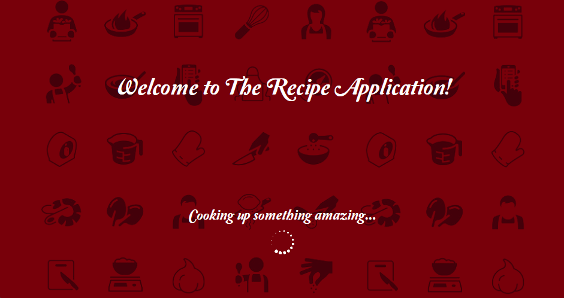

<div align="center">

<h1>👨‍🍳 Recipe Applications 🍽️</h1>

</div>

---

## 📑 Table of Contents

✨ 1. [**Introduction**](#-1-introduction)<br>
💻 2. [**Setting Up the Project Locally**](#-2-setting-up-the-project-locally)<br>
✅ 3. [**Features and Functionality**](#-3-features-and-functionality)<br> 
🗺️ 4. [**User Navigation**](#️-4-user-navigations)<br>
🖼️
🏗️
👥
⚖️
❓
📚


🗺️ 4. [**User Navigations**](#-4-user-navigations)<br> 
🖼️ 5. [**Screenshots**](#-5-screenshots)<br>
🏗️ 6. [**Architecture**](#-6-architecture)<br>
👥 7. [**Author and Contributions**](#-7-author-and-contributions)<br>
⚖️ 8. [**MIT License**](#-8-mit-license)<br>
❓ 9. [**Frequently Asked Questions (FAQ)**](#-9-frequently-asked-questions-faq)<br>
📚 10. [**References**](#-10-references)<br>

---

## ✨ 1. Introduction

Welcome to the **Recipe Applications**!

These applications are **comprehensive C# projects** designed to simplify the process of storing, managing, and analyzing your favorite recipes. Its core mission was inspired by the desire to help anyone start their journey into mastering the culinary arts.

The project began as a robust **command-line application** which allowed users to input the ingredients and steps for a single recipe, with the key feature of scaling the ingredient quantities by factors of 0.5, 2, or 3. It quickly evolved to support an unlimited number of recipes and was upgraded with a nutritional tracking system. This system allows the user to record calorie counts and food groups for each ingredient, calculates the total recipe calories, and uses a delegate to notify the user if a recipe's total calories exceed 300.

The final form of the application is a modern, user-friendly graphical interface built with **Windows Presentation Foundation (WPF)**. This front-end maintains all prior functionality while introducing advanced features, specifically the ability to filter the recipe list by ingredient, food group, or maximum calorie count, making recipe management intuitive and powerful.

From a simple console tool to a fully-featured desktop application, the Recipe Application is built to be the essential tool in your digital kitchen.

---

## 💻 2. Setting Up the Project Locally

This section guides you through setting up and running the WPF & Command-Line Application on your local machine.

### Command-Line Application

#### Prerequisites

To successfully compile and run this project, you must have the following installed on your system:

* **Operating System**: Any operating system that supports .NET Framework 4.7.2.
* **IDE**: Compatible version of Visual Studio (or an equivalent IDE like JetBrains Rider or VS Code with C# extensions).
* **Version Control**: **Git** for cloning the repository.
* **Frameworks** (Specified in App.config): .NET Framework 4.7.2 or later.
* **RAM**: Minimum 4GB
* **Disk Space**: Minimum 100MB free space
* **Dependencies** (Specified in `packages.config` for `UnitTestProject1`):
    * `MSTest.TestAdapter` (Version 2.2.10)
    * `MSTest.TestFramework` (Version 2.2.10)

#### Project Configurations

**`App.config`**:

`App.config` is the main configuration file for a .NET desktop application, defining settings like the target .NET Framework version and application-specific parameters.

```xml
<?xml version="1.0" encoding="utf-8" ?>
<configuration>
    <startup> 
        <supportedRuntime version="v4.0" sku=".NETFramework,Version=v4.7.2" />
    </startup>
</configuration>
```

**`packages.config`**:

`packages.config` lists the NuGet packages (libraries and tools) that a specific project in the solution depends on, along with their installed versions and target frameworks.

```xml
<?xml version="1.0" encoding="utf-8"?>
<packages>
  <package id="MSTest.TestAdapter" version="2.2.10" targetFramework="net472" />
  <package id="MSTest.TestFramework" version="2.2.10" targetFramework="net472" />
</packages>
```

#### Installation

**1. Clone the Repository**

  * Naviagte and click the green "**Code**" button at the top of this repository.
  * Copy the URL under the "**HTTPS**" tab (`https://github.com/singhishkar/Recipe-Applications.git`).
  * Navigate to the directory where you want to save the project (e.g., `cd Documents/Projects`).
  * Open your preferred terminal or command prompt and use the following command to clone the project:

```bash
git clone https://github.com/singhishkar/Recipe-Applications.git
```

  * This will create a new folder with the repository's name and download all the files and the entire history into it.
  * Alternatively, you may download as a ZIP file or clone using GitHub Desktop.

**2. Open the Solution**

  * Navigate into the newly created directory and open the solution file `(.sln)` in Visual Studio:

```bash
cd Recipe-Applications
```

  * In Visual Studio, go to `File > Open > Project/Solution` and select the `RecipesApplication.sln` file.

**3. Restore NuGet Packages**

Visual Studio should automatically prompt you to restore the NuGet packages for the unit testing project (`UnitTestProject1`). If it does not, you can manually restore them:
  1. Go to `Tools > NuGet Package Manager > Manage NuGet Packages for Solution...`
  2. At the top of the dialog, there should be a button labeled **Restore**. Click this to download the necessary MSTest dependencies defined in `packages.config`.

#### Running

**1. Set the Startup Project**

The solution contains two projects: `RecipesApplication` (the main application) and `UnitTestProject1` (the tests). You must set the main application as the one to execute.
  1. In the Solution Explorer, right-click on the **RecipesApplication** project.
  2. Select **Set as Startup Project**. This will make the project name **bold**.

**2. Build the Solution**

  1. Compile the code by building the solution:
  2. Go to **Build \> Build Solution** (or press **Ctrl+Shift+B**).
  3. Ensure the build completes successfully with "**Build succeeded**" in the output window.

**3. Start the Application**

You can now run the console application:
  * Go to **Debug \> Start Debugging** (or press **F5**) to run the application with the debugger attached.
  * Go to **Debug \> Start Without Debugging** (or press **Ctrl+F5**) to run the application directly.
    The console window will open, and the application's main menu will be displayed, allowing you to interact with the program.

**Optional: Run Unit Tests**
To verify the application's core logic is working correctly:
  1. Go to **Test \> Test Explorer** (or **Test \> Windows \> Test Explorer**).
  2. In the Test Explorer window, click the **Run All Tests** button.
  3. All tests defined in `TotalCaloriesTest.cs` should pass, confirming the expected behavior of the recipe calculation logic.

### Windows Presentation Foundation (WPF):

#### Prerequisites

To successfully compile and run this project, you must have the following installed on your system:

  * **Operating System**: **Microsoft Windows** is required, as WPF is a Windows-specific technology.
  * **Operating System Version**: Any version of Windows that supports **.NET Framework 4.7.2** is required. Generally, this includes **Windows 7 Service Pack 1 and newer versions** (like Windows 8.1 and Windows 10/11), as long as the necessary framework runtime is installed.
  * **IDE**: Compatible version of **Visual Studio** (or an equivalent IDE like JetBrains Rider or VS Code with C\# extensions).
  * **Version Control**: **Git** for cloning the repository.
  * **Frameworks**:
      * Primary Framework: **.NET Framework 4.7.2** or later (Specified in App.config).
      * UI Framework: **Windows Presentation Foundation (WPF)**
  * **RAM**: Minimum **4GB**
  * **Disk Space**: Minimum **100MB** free space
  * **Dependencies**: The project solely relies on the built-in libraries included with the target framework. **No external NuGet packages are currently required.**

#### Project Configurations

**`App.config`**

`App.config` is the main configuration file for a .NET desktop application, defining settings like the target .NET Framework version and application-specific parameters.

```xml
<?xml version="1.0" encoding="utf-8" ?>
<configuration>
    <startup> 
        <supportedRuntime version="v4.0" sku=".NETFramework,Version=v4.7.2" />
    </startup>
</configuration>
```

#### Installation

**1. Clone the Repository**

  * Naviagte and click the green "**Code**" button at the top of this repository.
  * Copy the URL under the "**HTTPS**" tab (`https://github.com/singhishkar/Recipe-Applications.git`).
  * Navigate to the directory where you want to save the project (e.g., `cd Documents/Projects`).
  * Open your preferred terminal or command prompt and use the following command to clone the project:

```bash
git clone https://github.com/singhishkar/Recipe-Applications.git
```

  * This will create a new folder with the repository's name and download all the files and the entire history into it.
  * Alternatively, you may download as a ZIP file or clone using GitHub Desktop.

**2. Open the Solution**

  * Navigate into the newly created directory and open the solution file `(.sln)` in Visual Studio:

```bash
cd Recipe-Applications
```

  * In Visual Studio, go to `File > Open > Project/Solution` and select the `RecipesApplication.sln` file.

**3. Restore NuGet Packages**

Since the project currently uses only core .NET assemblies, **there are no external NuGet packages to restore**. However, if any are added in the future:
  * Visual Studio typically performs an automatic restore. If it fails:
    1.  Right-click the solution in Solution Explorer and select **Restore NuGet Packages**.
    2.  Alternatively:
          * Go to `Tools > NuGet Package Manager > Manage NuGet Packages for Solution...`
          * At the top of the dialog, there should be a button labeled **Restore**.

#### Running

**1. Set the Startup Project**
In a solution with multiple projects, you must specify the main application project to execute:

  1. In the **Solution Explorer** window, locate the **RecipeWPF** project.
  2. Right-click on the **RecipeWPF** project name.
  3. Select **Set as Startup Project**. The project name should appear **bold**.

**2. Build and Run the Application**

  1. **Build the solution**: Go to **Build \> Build Solution** (or press **Ctrl+Shift+B**). Wait for the "**Build succeeded**" message in the output window.
  2. **Start the application**:
      * To run with the debugger attached (recommended for development), go to **Debug \> Start Debugging** (or press **F5**).
      * To run without the debugger, go to **Debug \> Start Without Debugging** (or press **Ctrl+F5**).
  * The WPF window (MainWindow.xaml) will launch, presenting the graphical user interface of the application.

---

## ✅ 3. Features and Functionality

### Command-Line Application

#### Core Recipe Management

* **Recipe Creation**: Users can create new recipes by entering the **recipe name**, **number of ingredients**, and **preparation steps**. Clear prompts guide the user through each required input.
* **Structured Recipe Display**: All recipe details—including ingredients, quantities, food groups, calorie counts, and steps—are presented in a **clean, readable format** within the console or interface.

#### Quantity Control and Data Management

* **Recipe Scaling**: Recipes can be scaled by predefined factors:
    * **0.5 (halve)**
    * **2 (double)**
    * **3 (triple)**

* All ingredient quantities are adjusted automatically, allowing users to tailor serving sizes as needed.
* **Reset to Original Values**: If scaling or modifications are made, users can **reset the recipe** to its original quantities, restoring the data to the state in which it was first created.
* **Clear Recipe Data**: A dedicated function allows users to **delete all saved recipe information**, making it easy to start fresh without leftover data from previous entries.

#### Usability and Stability

* **Intuitive Main Menu**: A **user-friendly main menu** provides straightforward navigation, allowing quick access to all application features such as creating, viewing, scaling, resetting, and clearing recipes.
* **Input Validation**: The application **validates user input** to ensure ingredient quantities, units, and steps are entered correctly. Clear warnings or prompts appear when incorrect values are detected.
* **Robust Error Handling**: The system includes **comprehensive error handling**, guiding users when invalid input or unexpected behaviour occurs. This improves usability and prevents application crashes.
* **Exit Feedback**: Upon closing the application, a **farewell message** is displayed, offering a clear and pleasant conclusion to the user session.

### Windows Presentation Foundation (WPF)

#### Core Functionality

* **Recipe Creation**: Users can create new recipes by entering key information such as the **recipe name**, **number of ingredients**, and **number of steps**. Clear prompts guide the user throughout the process.
* **Organized Recipe Display**: The complete recipe—including all ingredients and preparation steps—is presented in a **clean and structured format**, ensuring easy readability and reference.

#### Quantity Management

* **Scaling Functionality**: Users can scale a recipe by selecting a scaling factor. All ingredient quantities are **automatically recalculated**, allowing flexible adjustment of serving sizes.
* **Reset to Original Quantities**: If a recipe has been scaled or modified, users can **reset all ingredient quantities** to their original values, restoring the recipe to its initial state.
* **Clear Recipe Data**: Users may **delete all existing recipe data** to begin a new recipe without any leftover information from previous entries.

#### Usability and Stability

* **Intuitive Main Menu**: A **simple and user-friendly main menu** makes it easy to navigate between features such as creating, displaying, scaling, resetting, and clearing recipes.
* **Input Validation**: The application **validates user input** to ensure correct entry of ingredient quantities, units, and steps. Clear error messages guide users to correct any invalid inputs.
* **Robust Error Handling**: **Comprehensive error handling** provides helpful feedback when invalid data or unexpected actions occur, improving overall usability and preventing application crashes.

---

## 🗺️ 4. User Navigations

### Command-Line Application

#### 1. Welcome Message & Main Menu

* When the application launches, users are greeted with a main menu containing the following options:
  1. **Create Recipe**
  2. **Display Recipe**
  3. **Scale Recipe**
  4. **Clear Recipe**
  5. **Exit Application**

* Users must enter a number between **1–5** to access the corresponding feature.

> **Note:** Before using Display Recipe, Scale Recipe, or Clear Recipe, a recipe must first be created. These options will not function until the initial recipe has been entered.

#### 2. Entering Recipe Details

* After selecting **Create Recipe**, follow the on-screen prompts to input all required recipe details.

* Provide the **recipe name**, **ingredients**, and **preparation steps**.

* For each ingredient, the following information is required:
  * **Name**
  * **Unit of measurement**
  * **Quantity**
  * **Food group**
  * **Calorie count**

* For each step, provide a clear instruction describing the action to be performed.

#### 3. Displaying the Recipe

After entering all recipe details, return to the main menu and select **Display Recipe (Option 2)**.

* You will be asked to enter the **recipe name** (case-sensitive).
* The application will display the full recipe, including:
  * Ingredient list
  * Preparation steps
  * Total calorie count
* Review the displayed quantities and steps for verification or reference.

#### 4. Scaling the Recipe

* From the main menu, select **Scale Recipe (Option 3)**.

* You may scale ingredient quantities by one of the following factors:
  * **0.5** (halve)
  * **2** (double)
  * **3** (triple)
  * **Reset** (restore original values)

* After choosing a scaling option, all ingredient quantities, calorie totals, and units will be automatically updated.

#### 5. Clearing Recipe Data

* From the main menu, select **Clear Recipe (Option 4)**.
* Enter the **recipe name** (case-sensitive) when prompted.
* To confirm deletion of the recipe, type "**yes**".
* If you entered this menu by mistake, type "**no**" to cancel and return to the main menu without clearing any data.

#### 6. Exiting the Application

* From the main menu, select **Exit Application (Option 5)**.
* A farewell message and a brief countdown will be displayed before the application closes.

#### Important Notes

* Always follow on-screen instructions and respond to prompts accurately.
* Ensure that ingredient quantities, units, and steps are entered correctly.
* Incorrect or invalid inputs will result in an error or warning, prompting you to re-enter the data.

### Windows Presentation Foundation (WPF)

#### 1. Welcome Message & Main Menu

* When the application is launched, a **welcome screen** will appear for approximately **4 seconds** while the main menu loads.
* After this brief loading period, the **main menu** will become accessible.

#### 2. Entering the Recipe Name, Number of Ingredients & Number of Steps

> **Important:** A recipe must be created before attempting to display, scale, or delete any recipe.

* On the main menu, enter the recipe details in the **red input panel** on the left side of the interface.

* Provide the following information when prompted:
  * **Recipe name**
  * **Number of ingredients**
  * **Number of preparation steps**

* Click **“Enter Ingredients & Steps”** to proceed.

* You will then be asked to enter detailed information for each ingredient:
  * Name
  * Unit of measurement
  * Quantity
  * Food group
  * Calorie count

* For each step, provide a clear description of the required action.

#### 3. Entering Ingredient and Step Details

* Using the **green input panel**, supply all ingredient details (name, unit, quantity, food group, calories) in the designated fields.
* Enter each preparation step in the corresponding step fields.

#### 4. Saving & Displaying the Recipe

* Once all information has been entered, click **“Save & Display”**.
* The complete recipe—including ingredients, steps, food groups, and **total calorie count**—will be shown in the **purple display panel** on the right side of the interface.

#### 5. Displaying Recipe Names and Recipe Details

* To view all saved recipe names, click **“Display Recipe Names”**.

* To view the details of a specific recipe:
  1.  Click **“Display Recipe”**.
  2.  Enter the **recipe number** when prompted.
  3.  Click **“DISPLAY”** to show the full recipe.

> All recipes are stored and displayed **alphabetically**.

#### 6. Scaling a Recipe

* To scale an existing recipe, click **“Scale”**.
  * Enter the **recipe number**, followed by the desired **scaling factor**.
  * Click **“DISPLAY”** to apply scaling.

* To view the updated (scaled) recipe, use the **“Display Recipe”** button again.

#### 7. Deleting a Recipe

* Click **“Delete”** to remove a recipe.
* Enter the **recipe number** when prompted and click **“DISPLAY”** to confirm deletion.
* Use **“Display Recipe”** again to verify that the recipe has been successfully removed.

#### 8. Resetting a Recipe

* Click **“Reset”** to restore a recipe’s measurements to their original values.
* Enter the **recipe number**, then click **“DISPLAY”**.
* Use **“Display Recipe”** again to confirm that the recipe has been reset.

#### 9. Filtering Recipes

* Once recipes exist in the system, you may filter them using one of the following criteria:
  * Maximum calorie limit
  * Food group
  * Ingredients

* Click **“Search”** to apply the selected filter.

> **Note:** Only **one filter** may be applied at a time.

#### Note

* Always follow the on-screen prompts and instructions carefully.
* Ensure that quantities, units, and preparation steps are entered accurately.
* **Invalid input** will generate an error or warning, and you will be prompted to re-enter the information.

---

## 🖼️ 5. Screenshots

### Windows Presentation Foundation (WPF)

| Heading | Image / Screenshots |
| :------------------------------------: | :---------------------------------------------------------------------: |
| **Welcome/Onboarding Page** |  |
| **Main Page** |  |

---

## 🏗️ 6. Architecture

### Command Line Application Architecture

#### Layered/N-Tier Architecture

The Command Line Application follows a **Layered/N-Tier architecture**:

* **Presentation Layer (The Console)**: This layer handles user input (reading arguments, interactive prompts) and output (printing results).
* **Business Logic Layer**: This contains the core logic, rules, and operations of the application, independent of the input/output method.
* **Data Access Layer (DAL)**: This layer handles communication with data sources (e.g., files, databases, APIs - if any).

**Common Patterns**: Console apps leverage patterns like **Service Layer** to encapsulate business operations.

### Windows Presentation Foundation (WPF) Application Architecture

The Windows Presentation Foundatio (WPF) application, being a graphical user interface (GUIs), follows a **Model-View-ViewModel (MVVM)**.

#### Model-View-ViewModel (MVVM)

MVVM is specifically designed for XAML-based UI frameworks like WPF and Silverlight. 

**Model**:
* Represents the **data and business logic** (e.g., classes that hold data, services that fetch data, validation rules).
* It's completely **UI-independent**.

**View**:
* The **UI defined in XAML** (e.g., windows, controls, data templates).
* It defines the visual structure and appearance.
* It has a reference to the ViewModel via **Data Binding**.

**ViewModel**:
* Acts as a **bridge** between the View and the Model.
* It **exposes data and commands** from the Model in a way that is easy for the View to consume.
* It implements `INotifyPropertyChanged` to automatically update the View when data changes and uses `ICommand` to handle UI actions.

---

## 👥 7. Author and Contributions

### Primary Developer:
* I, ***Ishkar Singh***, am the sole developer and author of this project:
Email (for feedback or concerns): **ishkar.singh.108@gmail.com**

### Reporting Issues:
* If you encounter any bugs, glitches, or unexpected behaviour, please open an Issue on the GitHub repository.
* Provide as much detail as possible, including:
  * Steps to reproduce the issue
  * Error messages (if any)
  * Screenshots or logs (if applicable)
  * Expected vs. actual behaviour
* Clear and descriptive reports help improve the project effectively.

### Proposing Enhancements:
* Suggestions for improvements or feature enhancements are encouraged.
* You may open a Discussion or submit an Issue describing the proposed change.
* All ideas will be reviewed and considered for future updates.

---

## ⚖️ 8. MIT License

**Copyright © 2025 RecipesApplication**<br>
**Copyright © 2025 RecipeWPF**<br>

Permission is hereby granted, free of charge, to any person obtaining a copy of this software and associated documentation files (the "Software"), to deal
in the Software without restriction, including without limitation the rights to use, copy, modify, merge, publish, distribute, sublicense, and/or sell copies of the Software, and to permit persons to whom the Software is furnished to do so, subject to the following conditions:

The above copyright notice and this permission notice shall be included in all copies or substantial portions of the Software.

THE SOFTWARE IS PROVIDED "AS IS", WITHOUT WARRANTY OF ANY KIND, EXPRESS OR IMPLIED, INCLUDING BUT NOT LIMITED TO THE WARRANTIES OF MERCHANTABILITY, FITNESS FOR A PARTICULAR PURPOSE AND NONINFRINGEMENT. IN NO EVENT SHALL THE AUTHORS OR COPYRIGHT HOLDERS BE LIABLE FOR ANY CLAIM, DAMAGES OR OTHER LIABILITY, WHETHER IN AN ACTION OF CONTRACT, TORT OR OTHERWISE, ARISING FROM, OUT OF OR IN CONNECTION WITH THE SOFTWARE OR THE USE OR OTHER DEALINGS IN THE SOFTWARE.

## ❓ 9. Frequently Asked Questions (FAQ)

### 1. What software and knowledge do I need to run the **Recipe Application** locally?

* To run the **Recipe Application** locally, you'll need:
    * **Visual Studio 2019 or later** installed on your system.
    * **.NET Core 4.7.2 or later**.
    * **Basic knowledge of the C# programming language**, including how to write a console program that requires **user input**, apply **string manipulation**, and use **automatic properties**.

### 2. How do I install and set up the **Recipe Application** on my computer?

* To install and set up the **Recipe Application**:
    * **Clone or download the project repository** from the provided GitHub link.
    * Open **Visual Studio** and navigate to **File > Open > Project/Solution**.
    * Browse to the location of the cloned/downloaded project and select the **solution file (.sln)**.
    * **Build the solution** to ensure all dependencies are resolved.
    * **Run the application** by pressing **F5** or clicking on the **Start Debugging** button in Visual Studio.
    * Follow the **on-screen prompts** to interact with the **Recipe App** and enter recipe details.

### 3. What functionalities does the **Recipe Application** offer, and how do I use them?

* The **Recipe Application** offers the following functionalities:
    * **Create Recipe**: Input recipe details such as **name, ingredients, and steps**.
    * **Display Recipe**: View the **full recipe**, including ingredients and steps.
    * **Scale Recipe**: **Adjust ingredient quantities** for different serving sizes.
    * **Clear Recipe**: **Remove all entered data** to start afresh.
    * **Exit Application**: **Close the Recipe Application**.

* To use these functionalities:
    * Upon launching the application, follow the **on-screen instructions** to navigate the **main menu**.
    * Enter the corresponding **number (1-5)** for the desired action.
    * Follow additional prompts to input recipe details, display recipes, scale them, clear data, or exit the application.

### 4. What should I do if I encounter errors or need assistance while using the **Recipe Applications**?

If you experience an error while entering recipe details, please follow the steps below:

1. **Verify your input values**:
    * Ensure all **numerical fields**—such as ingredient quantities and calorie counts—contain **valid numeric values only**.
    * Confirm that **units of measurement** correspond to those supported by the application (e.g., **grams, milliliters, teaspoons, etc.**).

2. **Check for formatting issues**:
    * Avoid using **special characters or symbols** in fields that accept only alphabetic input (such as ingredient names or step descriptions).
    * Ensure you have **not left mandatory fields blank**.

3. **Review the prompts**:
    * The application provides **real-time validation** and prompts for incorrect or incomplete entries. **Address each highlighted issue before proceeding**.
    * Pay attention to any **error messages or prompts** displayed on the screen.
    * If you're unsure about a particular step, refer back to the **usage instructions** provided in the documentation.

4. **Restart the application if necessary**:
    * In the event that the error persists despite correct input, **close and reopen the application**. This may resolve temporary or cached input conflicts.

5. **Contact the Author if all else fails**:
    * If the problem continues after following these steps, please consider reporting the issue through the **GitHub repository**, alternatively contact the **primary developer** for further assistance.

### 5. What steps should I take if the application becomes unresponsive?

If the application becomes unresponsive or freezes, try the following actions:

1. **Close and relaunch the application**:
    * This resolves most **temporary UI freezes** or non-critical memory handling issues.

2. **Check system resource usage**:
    * Open the **Task Manager** (Windows: `Ctrl + Shift + Esc`) and verify whether your system is experiencing high **CPU, memory, or disk usage**.
    * Look for any **background processes**—especially **.NET applications** or heavy programs—that may be interfering with the app’s performance.

3. **Confirm your system meets requirements**:
    * Ensure your device meets the **minimum runtime requirements** for the application, including the correct version of **.NET**.

4. **Restart your system if needed**:
    * If the application continues to freeze, performing a **full system restart** may help clear locked processes or resource conflicts.

* If the issue persists after these steps, please submit a **detailed report** via the **GitHub Issues page**.

### 6. How can I check for available updates or update the application?

To stay up to date with the latest features, bug fixes, and improvements:

1. **Visit the GitHub repository**:
    * Navigate to the project’s main **GitHub page** and check the **Releases section** for new versions.

2. **Download the latest release**:
    * Each release includes **updated binaries or source code**. Download the version appropriate for your setup.

3. **Replace outdated application files**:
    * If you manually installed the application, **replace your existing files** with the new versions.
    * If working with source code, **pull the latest changes** and **rebuild the solution**.

4. **Read the release notes**:
    * **Release notes** often include details on new features, breaking changes, migration steps, and resolved issues.

### 7. How should I report a bug or unexpected application behaviour?

1. Thank you for helping improve the application. To report a bug:
    * **Open an Issue on GitHub**: Go to the repository’s **Issues tab** and **create a new issue**.

2. **Provide detailed information**:
    Include, where possible:
    * A **clear description** of the problem
    * **Step-by-step instructions** on how to reproduce the issue
    * **Expected behavior vs. actual behavior**
    * **Screenshots, console output, or error logs** (if applicable)
    * Your **system information** (operating system, .NET version, etc.)

3. **Use clear and descriptive titles**:
    * This helps **categorize and prioritize issues** efficiently.
    * The more detail provided, the easier it will be to diagnose and resolve the problem.

### 8. What should I do if the application fails to launch?

If the application fails to start, consider the following troubleshooting steps:

1. **Verify .NET Framework installation**:
    * Ensure that **.NET Framework 4.7.2 or higher** is installed on your system.
    * You may download the required runtime from **Microsoft’s official website** if necessary.

2. **Check the build integrity** (for source code users):
    * If running from the source code, ensure that the project **builds successfully** in your IDE with **no compilation errors**.
    * Confirm that all project dependencies and **NuGet packages** are properly **restored**.

3. **Ensure file integrity**:
    * Make sure no essential application files are **missing or corrupted**. If unsure, **re-download the application or clone the repository again**.

4. **Run as administrator** (if required):
    * Certain systems may restrict application execution. Right-click the executable and select **Run as administrator**.

* If the application still does not launch, please **report the issue through GitHub** with system details and any error messages received.

---

## 📚 10. References

- **BroCode, n.d. C# Full Course for free.** [online] _[youtube.com](https://www.youtube.com/watch?v=wxznTygnRfQ&t=10600s&ab_channel=BroCode)_ [Accessed 6 April 2024].
- **Christensen, M., n.d. Creating a List of Lists in C#.** [online] _[stackoverflow.com](https://stackoverflow.com/questions/12628222/creating-a-list-of-lists-in-c-sharp)_ [Accessed 21 April 2024].
- **Reddit, n.d. await Task.Delay(1000) vs await Task.Run(() => Thread.Sleep(1000)).** [online] _[reddit.com](https://www.reddit.com/r/csharp/comments/8qbp5g/await_taskdelay1000_vs_await_taskrun/)_ [Accessed 6 May 2024].
- **Stack Overflow, n.d. await Task.Delay vs Task.Delay().Wait().** [online] _[stackoverflow.com](https://stackoverflow.com/questions/26798845/await-task-delay-vs-task-delay-wait)_ [Accessed 19 May 2024].
- **Stack Overflow, n.d. How to show emoji in C# console output.** [online] _[stackoverflow.com](https://stackoverflow.com/questions/67508469/how-to-show-emoji-in-c-sharp-console-output)_ [Accessed 5 June 2024].
- **Troelsen, Andrew, and Phillip Japikse, 2021. Pro C# 9 with .NET 5: Foundational Principles and Practices in Programming.** N.p.: Apress.
- **Unicode Consortium, n.d. Full Emoji List.** [online] _[unicode.org](https://unicode.org/emoji/charts/full-emoji-list.html)_ [Accessed 17 June 2024].
